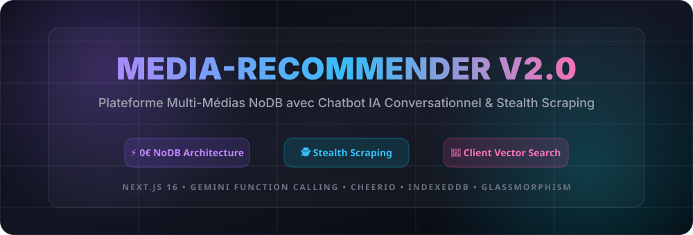
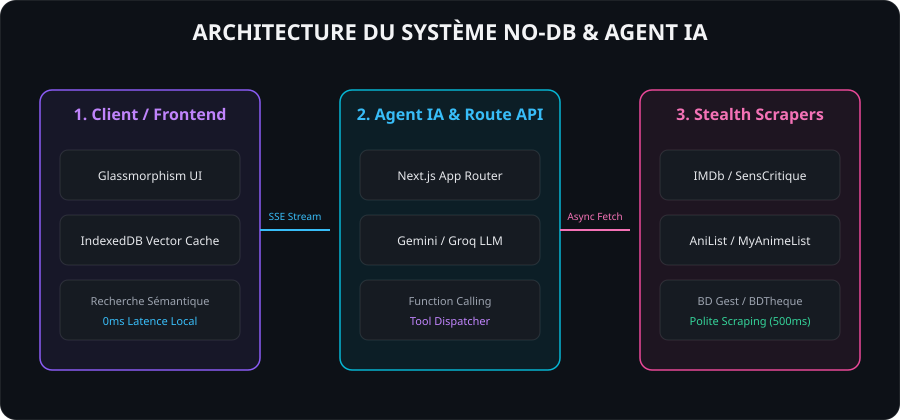

<p align="center">
  
</p>

<p align="center">
  <a href="#-fonctionnalités-clés"></a>
  <a href="#-moteur-de-scraping-furtif"></a>
  <a href="#-chatbot-ia--function-calling"></a>
  <a href="#-licence--éthique"></a>
</p>

---

## 🌟 Présentation du Projet

**Média-Recommender V2.0** est une plateforme multi-médias de recommandation nouvelle génération (Films, Séries, Animes, Mangas, Bandes Dessinées & Comics), conçue sans **aucune base de données serveur (0€ de coût DB)**.

L'application repose sur un **Chatbot IA Conversationnel** capable d'invoquer des outils en temps réel (*Function Calling*), de scraper des sources web légitimes avec une emprunte indétectable (*Stealth & Polite Scraping*), et de mettre en cache les vecteurs d'embeddings directement dans le navigateur client (**IndexedDB + Vector Search**).

---

## 🚀 Fonctionnalités Clés

- **💬 Chatbot IA Conversationnel (SSE Streaming)** : Discutez naturellement avec l'agent IA qui comprend vos préférences culturelles complexes.
- **⚡ Function Calling / Tool Use** : L'IA déclenche automatiquement la recherche et le filtre sur les scrapers backend.
- **🕵️ Scraping Furtif Multi-Sources** :
  - **IMDb & SensCritique** pour le Cinéma & Séries TV.
  - **AniList & MyAnimeList** pour l'animation japonaise et mangas.
  - **BD Gest & BDTheque** pour le 9ème Art (BD Franco-Belge, Comics).
- **🧠 Vector Cache Client (0ms Latence)** : Vectorisation locale et recherche de similarité cosinus dans l'IndexedDB du navigateur.
- **🎨 Glassmorphic Dark UI** : Interface premium ultra-réactive avec cartes médias interactives, notes, trailers YouTube et gestionnaire de favoris NoDB.
- **📥 Export JSON / CSV** : Exportation locale de vos listes de lecture et favoris en un clic.

---

## 📐 Architecture du Système

<p align="center">
  
</p>

---

## 🛠️ Stack Technique

- **Frontend & App Framework** : [Next.js 16 (App Router)](https://nextjs.org/) + TypeScript.
- **Modèle de Langage & Function Calling** : Google Gemini 1.5 Flash (`@google/generative-ai`) / Groq.
- **Moteur de Scraping** : `Cheerio`, `PoliteFetch` HTTP/2 avec rotation d'en-têtes et respect des rate limits.
- **Recherche Vectorielle Client** : IndexedDB, Cosine Similarity engine & Embeddings local fallback.
- **Design & Styles** : Glassmorphism CSS avec variables Tailwind CSS v4.

---

## 📦 Installation & Démarrage Rapide

### 1. Prérequis
- Node.js version 18 ou supérieure.
- Clef d'API Gemini (Optionnelle mais recommandée pour l'IA en direct).

### 2. Cloner le Dépôt
```bash
git clone https://github.com/votre-user/media-recommender.git
cd media-recommender
```

### 3. Installer les Dépendances
```bash
npm install
```

### 4. Configurer l'Environnement
Créez un fichier `.env.local` à la racine :
```env
GEMINI_API_KEY=votre_cle_gemini_ici
```

### 5. Lancer le Serveur de Développement
```bash
npm run dev
```
Rendez-vous sur `http://localhost:3000` !

---

## 📜 Charte Éthique & Polite Scraping ("Limite-Limite")

Le projet applique une politique d'ingénierie responsable :
1. **Pas de contournement forcé de CAPTCHA** (abandon et bascule automatique vers l'API fallback).
2. **Charge serveur limitée** : Maximum 2 requêtes simultanées et délai minimum de 500ms entre requêtes.
3. **Hotlinking officiel & Placeholders** : Aucun stockage illégal d'images sous copyright sur le serveur.
4. **Zéro Log d'IP** : Soucieux du RGPD, aucune donnée personnelle ou IP n'est enregistrée.

---

## 🤝 Contribution

Les contributions sont les bienvenues ! Veuillez lire le fichier [CONTRIBUTING.md](CONTRIBUTING.md) pour connaître les règles de soumission et les conventions de code.

---

## 📄 Licence

Distribué sous la licence MIT. Voir `LICENSE` pour plus d'informations.
